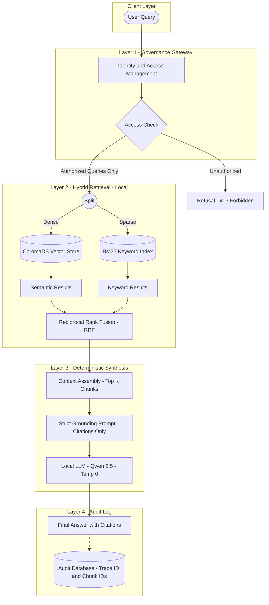

# Governed, Auditable RAG System for Enterprise & Government


> **"If a chatbot hallucinates in a creative writing app, it's funny. If it hallucinates in a government procurement workflow, it’s a lawsuit."**

## 🎯 The Problem: When "Close Enough" Isn't Good Enough

In **GovTech** and regulated enterprise environments, the standard RAG stack (Vector DB + OpenAI) is a non-starter. These sectors operate under constraints that distinguish them from commercial deployments:

* **Zero Trust in Cloud APIs**: Sending sensitive contracts to OpenAI/Anthropic is prohibited by data sovereignty laws. The pipeline must run **locally**.
* **Auditability is King**: A black-box answer is unacceptable. If the system affirms a policy, it must cite the *exact* clause.
* **Legacy Infrastructure**: Solutions must run on commodity servers (CPUs or older GPUs), not just massive H100 clusters.

This project is a **Governed, Deterministic RAG System** that prioritizes safety, auditability, and verifiable citations over raw generative capability.

---

## 🏗️ High-Level Architecture

We architected the system as a series of checkpoints, where every layer has a specific governance role.


---

## 🛡️ Core Design Decisions

### 1. Governed Retrieval (Hybrid Search + RRF)
Instead of relying solely on vectors (which struggle with specific clause numbers like "Section 4.1.2"), we use **Hybrid Search**:
* **Dense Retrieval (ChromaDB)**: Captures semantic intent.
* **Sparse Retrieval (BM25)**: Anchors results to specific keywords.
* **Fusion**: Results are merged using **Reciprocal Rank Fusion (RRF)**, ensuring the most relevant documents bubble to the top regardless of the method.

### 2. The "Auditor" Persona (Temperature = 0)
We clamp the model's creativity. The `temperature` is set to `0`, and the prompt explicitly forbids using outside knowledge.
* **Strict Grounding**: "Answer ONLY using the provided chunks. Cite every claim as `[C1]`, `[C2]`."
* **Constructive Refusal**: If the answer is not in the context, the model returns `INSUFFICIENT_CONTEXT` rather than hallucinating.

### 3. Metadata-First Security
Security is not an afterthought. We enforce **Metadata-First Filtering**. Before retrieval begins, the query is scoped using metadata filters (e.g., `access_level: "classified"`). Unauthorized documents are mathematically invisible to the query.

---

## 📊 Evaluation & Failure Analysis

We rigorously tested the system using a "Golden Dataset" of real-world policy questions.

**The Result: 75% Pass Rate**
While 75% seems low for general AI, in a governance context, it represents a system that **refused to guess** 25% of the time.

| Failure Type | Count | Root Cause |
| :--- | :--- | :--- |
| **No Citations** | 3 | Small model (3B) retrieved correct info but failed strict formatting rules. |
| **Source Not Found** | 1 | Semantic drift between query and document was too large for embedding model. |

---

## ⚖️ Tradeoffs & Infrastructure Strategy

### 1. Hybrid Infrastructure (GPU/CPU)
* **Dev Environment**: Quantized Qwen 2.5 running on **T4 GPU** (via Colab) for rapid prototyping.
* **Production Target**: The architecture supports **CPU-only fallback** (GGUF format) for on-premise government servers.
* **Result**: We achieve **sub-second latency** on GPU, while maintaining 100% compatibility with legacy CPU infrastructure.

### 2. In-Memory vs. Distributed Indexing
* **Decision**: Hydrate the BM25 index into memory at startup.
* **Tradeoff**: Slower startup time (~20s).
* **Benefit**: Drastically simplifies architecture (no ElasticSearch cluster required).

---

## 💻 Technical Implementation & Setup

### Prerequisites
- Python 3.10+
- Docker (optional)
- LLM Backend (local llama.cpp or Colab with ngrok)

### Option 1: Local Installation

```bash
# Clone the repository
git clone https://github.com/thabsheer/governed-rag-system.git
cd governed-rag-system

# Create virtual environment
python -m venv venv
source venv/bin/activate  # On Windows: venv\Scripts\activate

# Install dependencies
pip install -r requirements.txt

# Configure LLM endpoint
cp .env.example .env
# Edit .env with your LLM_ENDPOINT

# Start the server (auto-ingests documents on first run)
uvicorn app.api.server:app --reload --port 8000
```

### Option 2: Docker

```bash
docker-compose up --build
```

### API Endpoints

| Endpoint | Method | Description |
|----------|--------|-------------|
| `/health` | GET | Health check |
| `/query` | POST | Retrieval only (Debug mode) |
| `/answer` | POST | Full RAG: Retrieval + LLM synthesis |

### Example Request

```bash
curl -X POST http://localhost:8000/answer \
  -H "Content-Type: application/json" \
  -d '{"text": "How should AI systems handle personal data?", "k": 5}'
```

---

## 📂 Project Structure

```
governed-rag-system/
├── app/
│   ├── api/          # FastAPI server & schemas
│   ├── core/         # Synthesizer, logger, database
│   ├── models/       # LLM loader & backends
│   └── retrieval/    # Hybrid retriever (Dense + BM25)
├── data/
│   ├── docs/         # Source documents (PDF, MD)
│   └── chroma_db/    # Vector store
├── tests/            # Evaluation scripts
└── requirements.txt
```

---

## 📜 License

MIT